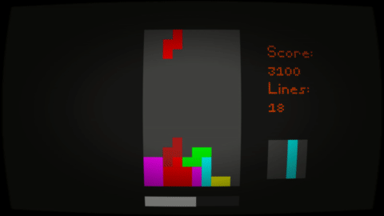

Example
=======

The tetris library ships with an example Love2D game.

Run `love .` in this directory(See `main.lua`).




Controls
--------

`left`, `right`, `down`, `up`, `q`, `e`: Move current block

`return`: Reset the game

`f11`, `escape`: Enable/disable fullscreen


Usage
=====

```lua
game = require("tetris").new() -- create an instance of the game
game:reset() -- reset game(required before use)

function game:on_gameover() -- on gameover, call callback
	print("Your score:", self.score)
	-- reset before new use
	self:reset()
end

-- in game loop
game:update_timer(dt)

-- on key press
if key == "left" then
	game:left() -- move the current tile left("left key")
end


```


API
===

```lua
game = require("tetris").new()
```

Create a new `game`. All state and all functions are in the game table, (no upvalues/globals). The module is not required for anything besides creating a game instance. This also means any value can be overwritten, and should work after a :reset()


`game` Functions
----------------

`game:reset()`

Reset the game state. Required before use and after gameover.


`down = game:update_timer(dt)`

Increment the internal timer by `dt`. This specifies the time units used, and is only used to drop the current block by every `game.autodown_timeout`. `down` is set if the down action was taken because a timeout was reached.


`moved = game:left(), game:right(), game:drop(), game:rotate_left(), game:rotate_right(), game:down()`

Perform the specified action on the current block. `moved` is set if the block was able to move.


`game` Callbacks
---------

`game:on_gameover()`

Called when the game has ended because a new tile could not be placed without collision. The game needs to be reset using `game:reset()` before reuse.


`game:on_block_set(x,y,block_id)`

Called when a block collided with the board(The block gets "frozen"). `x` and `y` are the top-left position of the block. `block_id` is the index in the `game.blocks` table.


`game:on_line_remove(y)`

Called when a line is complete, and thus removed. `y` is the line that was removed.


`self:on_score(add, combo)`

Called when the score changed. `add` is the number that was added to the score, `combo` is the number of lines that were responsible for the score change.


`game` Values
-------------

`game.score`

current score of game


`game.lines`

total completed lines


`game.gameover`

is true if game has ended(no more input)


`game.block_id`, `game.next_block_id`

index of the currently/next dropping block


`game.block_x`, `game.block_y`, `game.block_r`

position and rotation on the currently dropping block


`game.autodown_time`

time passed since last down action


`game.autodown_timeout`

perform down action if the down-action is not taken in timeout


`game.board`

table containing board state. `tile_id = game.board[y][x]`


`game.board_w`, `game.board_h`

Dimensions of the board. (Default: 10, 16)


`game.spawn_x`

X position of new blocks. (Default: 4)


`game.combo_scores`

List of points that will be added to the score. Index is number of lines destroyed in the current move. (Default {100,300,500,800})


`game.block_w`, `game.block_h`

Dimensions of each block. (Default 4,4)


`game.blocks`

table containing the blocks. (Default table with tetrominos) `set = (game.blocks[block_id][y][x] ~= 0)`
